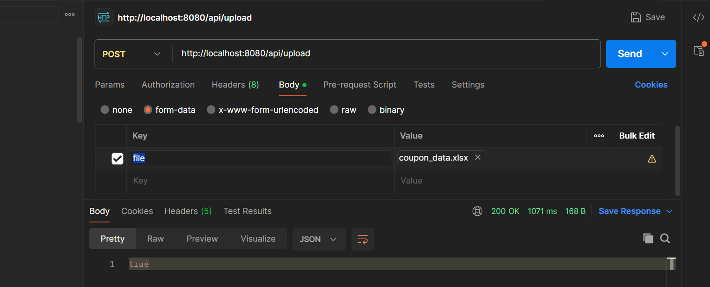

# Coupon API

A Spring Boot application for managing coupons. The application allows users to create, update, list, and upload coupons via Excel files. The API provides endpoints for CRUD operations related to coupons and supports bulk upload via Excel.

---
## Requirements

I want you to make a sample java spring application with DB Table:

1. **Create a database table `COUPON`** in postgres with the fields as per excel in the attachment.

2. **Build the following APIs in Java:**

   i. **List all coupons**  
      **GET** `/coupons`  
      Response: List of all coupons.

   ii. **Create a coupon**  
      **POST** `/coupon`  
      Request: Body of the coupon.  
      Response: Boolean (true, if created successfully).

   iii. **Update a coupon**  
      **PUT** `/coupon`  
      Request: Body of the coupon.  
      Response: Boolean (true, if updated successfully).

   iv. **Upload Excel and create a list of coupons**  
      **POST** `/upload`  
      Request: File.  
      Response: Boolean (true, if updated successfully).

## Features

- List all coupons
- Create a new coupon
- Update an existing coupon
- Upload coupons in bulk via an Excel file

## Prerequisites

- Java 17 or later
- Spring Boot 3.4.1
- Maven
- PostgreSQL (or any other database of your choice)

- ## Screenshot
  
Here is a Postman screenshot of the uploaded coupon Excel file: <br>
- Excel Version - 2021


### Download Coupon Excel File

To test the upload functionality, you can download a Coupon Excel file below:

[Download Coupon Excel File](src/main/resources/temporary-folder/coupon_data.xlsx)

### Example JSON for Coupon

Here is an example JSON object for creating a coupon:

```json
{
  "category": "Electronics",
  "categoryValue": "Smartphones",
  "couponCode": "SMART10",
  "validityInDays": 30,
  "discountType": "Percentage",
  "discountValue": 10.0,
  "discountOn": "Total Purchase",
  "discountOnSelectedItems": "Selected Smartphones",
  "issueDateFrom": "2025-01-01",
  "issueDateTill": "2025-01-31",
  "issuedOnSpentOf": "Amount",
  "issuedOnMinimumSpent": 100.0,
  "applicableOnSpentOf": "Amount",
  "applicableOnGender": "All",
  "applicableOnCustomerCategory": "New"
}
```

Below are the available API endpoints for managing coupons:

- **Create a Coupon**:
    `POST http://localhost:8080/api/coupon`
- **Uploade a Coupon excel file**:
    `POST http://localhost:8080/api/upload`
- **Update an Existing Coupon**:
    `PUT http://localhost:8080/api/coupon`
- **Get All Coupons**:
    `GET http://localhost:8080/api/coupons`

## Contact

For any queries or feedback, please contact [pramodkumar912894@gmail.com].
